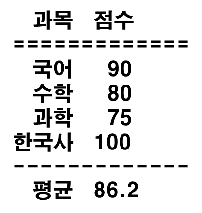

# 📝 C프로그래밍 실습 자료

## 2️⃣ 2주차 [9월 9일 ~ 9월 15일]

## 📖 1번 문제
- ### 아래 문장을 출력하세요. [정답](./practice_1.c)
># 10, 20, 30, 40, 50의 평균은 30입니다.
>>조건1 : printf를 한번만 사용할 것 
>>조건2 : 산술 연산자를 사용하여 평균을 계산할 것 
>>조건3 : 적절한 형식 지정자를 사용할 것

## 📖 2번 문제
- ### 나눗셈을 계산하여 출력하세요. [정답](./practice_2.c)
># 125 / 8 = 16.62
>>조건1 : 소수점 둘째 자리까지 계산할 것 
>>조건2 : 산술 연산자를 사용하여 나눗셈을 할 것 
>>조건3 : 적절한 형식 지정자를 사용할 것

## 📖 3번 문제
- ### 모든 줄에 형식 지정자를 무조건 사용하여 아래와 같이 출력하세요. [정답](./practice_3.c)
># 이름 : 아무 이름 영문 이름 : 아무 영문 이름 학년 : 4 휴대폰 : 010-1234-5678 키 : 123.45cm
>>임의로 작성해도 상관 없음

## 📖 4번 문제
- ### 모든 줄에 적절한 형식 지정자를 사용하여 아래와 같이 출력하세요. [정답](./practice_4.c)
># 33의 8진수 값은 041 33의 16진수 값은 0x21 00001.20 +123 1.234560e-01
>>조건1 : %s 사용 금지 

## 📖 5번 문제
- ### 오른쪽 정렬을 사용하여 아래와 같이 정렬하여 출력하세요. [정답](./practice_5.c)
># `