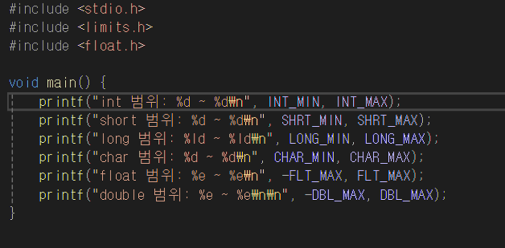

# 📝 C프로그래밍 실습 자료

## 3️⃣ 3주차 [9월 16일 ~ 9월 22일]

## 📖 0번 문제
- ### 아래의 코드로 각 타입의 변수들이 저장할 수 있는 수의 범위를 알 수 있습니다.
- ### 수의 범위를 초과하게 코드를 수정(추가)하고 초과한 결과에 대해서 생각 해보세요. [`정답`](./practice_0.c)
>
>>조건1 : 각 타입의 변수를 선언하고 값을 저장하게 코드를 작성할 것

## 📖 1번 문제
- ### 아래 문장을 출력하세요. [`정답`](./practice_1.c)
># A값 = 12, B값 = 17 A값 = 17, B값 = 12
>>조건1 : 변수는 최대 3개 사용 가능하고 변수에 값을 저장할 것 
>>조건2 : 적절한 형식 지정자를 사용할 것 
>>조건3 : %s는 사용하지 말 것

## 📖 2번 문제
- ### 상자의 부피를 구하는 프로그램을 작성하세요. [`정답`](./practice_2.c)
># 상자 가로 : 10cm 상자 세로 : 17.2cm 상자 높이 : 14.6cm 부피 : ??? cm
>>조건1 : 변수에 값을 저장하고 계산을 할 것 
>>조건2 : 상자의 가로 길이를 저장하는 변수는 int, 그 외에는 double형을 사용할 것

## 📖 3번 문제
- ### 환율을 계산하는 프로그램을 작성하세요. [`정답`](./practice_3.c)
># 1달러 => 1332.2원 125달러 => ???원 1000원 => ???달러 130만원 => ???달러
>>조건1 : 변수에 값을 저장할 것 

## 📖 4번 문제
- ### A에서 B까지의 거리는 500km입니다.
- ### 이 구간을 버스로 주행했을 때 6시간이 소요되었고 연료는 40L 소비하였습니다.
- ### 이를 변수에 저장하여 A에서 B까지의 평균 속도와 연비를 출력하는 프로그램을 작성하세요. [`정답`](./practice_4.c)
>>조건1 : 변수를 선언하고 값을 변수에 저장할 것 
>>조건2 : 평균 속도는 소수점 둘째 자리까지, 연비는 소수점 첫째 자리까지만 출력할 것

## 📖 5번 문제
- ### A는 B에게 비밀 쪽지를 C언어로 보내기로 했습니다. 이를 해석하세요. [`정답`](./practice_5.c)
># 73 - 104,97,118,101 - 97 - 112,101,110,46
>>조건1 : 영어로 출력할 것 
>>조건2 : 위의 암호를 변수에 저장하여 사용할 것 
>>조건3 : 아스키코드 표를 참고할 것 
>>선택1 : 값은 값은 하나의 변수에 저장해보세요.

## 📖 5-1번 문제
- ### 5번 문제에서 맨 마지막 단어를 cat으로 바꿔보세요 [`정답`](./practice_5_1.c)
>>선택1 : 바뀐 값을 변수에 저장해보세요.  