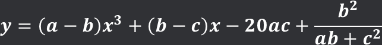

# 📝 C프로그래밍 실습 자료

## 5️⃣ 5주차 [9월 30일 ~ 10월 06일]

## 📖 1번 문제
- ### a, b, c, x를 입력 받아 y를 계산하는 프로그램을 작성하세요. [`정답`](./practice_1.c)
># 
>>조건1 : a, b, c, x은 정수(整数)형으로 입력 받습니다 (int)  
>>조건2 : 계산 결과는 실수형으로 출력해야 합니다

## 📖 2번 문제
- ### 천원 이하의 거스름 돈을 입력 받아 필요한 500원, 100원, 50원, 10원 동전의 개수를 계산하여 출력하는 프로그램을 작성하세요. [`정답`](./practice_2.c)
>>조건1 : 100원과 10원의 개수는 4개 이하여야 할 것 
>>조건2 : 10원 이하의 금액은 절사한 후 계산하게  코드를 작성할 것 ! 예) 947원 -> 940원 
>>선택1 : 절사 된 금액을 출력하게 코드를 약간 수정해 보세요 ! 예) 947원 -> 7원 절사

## 📖 3번 문제
- ### ??? 부분에 식을 작성하여 아래와 같이 출력되도록 코드를 작성하세요 [`정답`](./practice_3.c)
># int a = 2, b = 5; int c = ???; printf("%d, %d, %d\n", a, b, c);
>>조건1 : 다른 부분은 수정하지 말 것! ???에 증감연산자를 사용하여 a와 b값을 바꿔야 합니다 
>>조건2 : 산술 연산자와 증감 연산자만 사용할 것! 식에 숫자를 넣으면 안됩니다

## 📖 4번 문제
- ### 2개의 숫자를 입력 받고 다음의 결과를 출력하는 코드를 작성하세요. [`정답`](./practice_4.c)
># 계산1 -> 두 숫자가 같으면 곱한 값을 아니면 0을 출력 계산2 -> 첫번째 숫자가 두번째 숫자보다 크면 첫번째 숫자 / 두번째 숫자의 나머지를 아니면 0을 출력
>>조건1 : 조건문 (if)을 사용하지 말 것