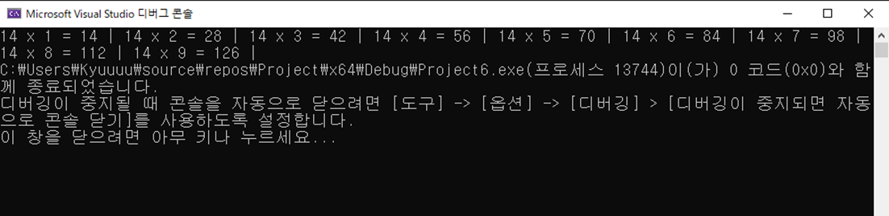

# 📝 C프로그래밍 실습 자료

## 8️⃣ 8주차 [10월 21일 ~ 10월 27일]

## 📖 1번 문제
- ### 구구단의 단을 입력 받고 그 단의 구구단을 출력하는 프로그램을 작성하세요. [`정답`](./practice_1.c)
> ### 조건1 : for문을 사용하고 6줄 이내로 작성할 것
> ### 조건2 : 구구단을 정렬하여 출력할 것
>> 

## 📖 2번 문제
- ### 정수를 입력 받아 이진수로 출력하는 프로그램을 작성하세요. [`정답`](./practice_2.c)
> ### 조건1 = unsigned short int에 값을 저장할 것
> ### 조건2 = 입력한 숫자가 255이하인 경우에는 8bit로 255보다 크면 16bit로 출력할 것
> ### 조건3 = 반복문을 사용할 것

## 📖 3번 문제
- ### x에 -1이 입력되기 전까지 계속 반복하는 계산기 프로그램을 만드세요. 계산기는( + - * / ) 연산이 가능해야 합니다. [`정답`](./practice_3.c)
> ### 조건1 = 연산자를 잘못 입력한 경우에는 에러를 출력합니다
> ### 조건2 = 연산 횟수를 카운트 하여 각 계산 결과의 맨 앞에 출력해야 합니다
> ### 조건3 = 0으로 나누려고 하는 경우를 고려하여 적절한 예외처리를 할 것
> ### 조건4 = x와 y에는 실수 값이 들어갈 수도 있습니다
> ### 조건5 = 연산자를 잘못 입력한 경우와 0으로 나눈 경우에는 연산 횟수를 카운트 하지 않습니다

## 📖 4번 문제
- ### 정수를 2개 입력 받고 1이상 1000 이하의 두 정수의 공배수를 모두 출력하고 총 개수까지 출력하세요! 단 공배수 중에 666이 있으면 666이전까지의 배수를 출력합니다 [`정답`](./practice_4.c)
> ### 조건1 = 공배수가 1000을 넘어가는 경우에는 “1000 이하의 공배수 없음”을 출력할 것
> ### 조건2 = 입력한 두 정수가 2보다 작거나 1000보다 크면 다시 입력하게 할 것
> ### 조건3 = 입력한 두 정수가 같은 경우도 다시 입력하게 할 것