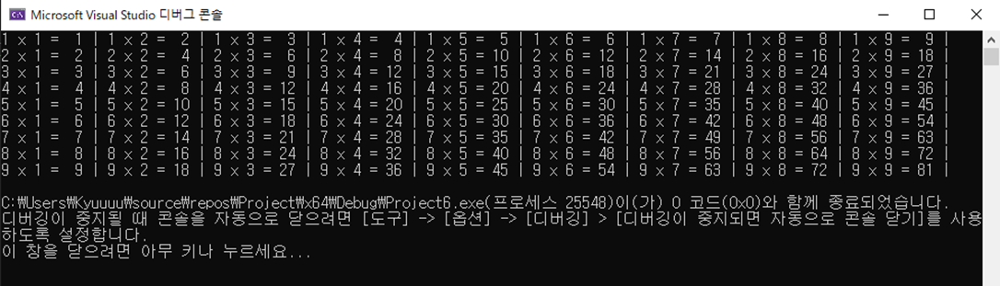

# 📝 C프로그래밍 실습 자료

## 🔟 10주차 [11월 4일 ~ 11월 10일]

## 📖 1번 문제
- ### 구구단을 1단부터 9단까지 출력하세요 ! 단 for문이 아닌 while문을 사용해야 합니다. [`정답`](./practice_1.c)
> ## 조건1 : while문을 사용하고 break를 사용하지 말 것
> ## 조건2 : 구구단을 정렬하여 출력할 것
>> 실행 예시 
>> 

## 📖 2번 문제
- ### 랜덤 숫자를 생성하여 업다운 게임을 만드세요. [`정답`](./practice_2.c)
> ## 조건1 = 정답을 맞출 때까지 프로그램이 계속 실행이 되어야 합니다
> ## 조건2 = 랜덤 숫자의 범위는 1~100 입니다
> ## 조건3 = 범위에 벗어난 숫자를 입력한 경우에는 다시 입력하게 유도할 것
> ## 조건4 = continue, break를 사용할 것

## 📖 3번 문제
- ### 출력할 특수문자 ch와 개수 num을 입력 받고 오른쪽 기준으로 정렬하여 출력하세요. [`정답`](./practice_3.c)
> ## 조건1 = 특수 문자는 * & % $만 사용 가능하고 그 외의 문자가 입력된 경우 아무것도 출력하지 않을 것
> ## 조건2 = num과 ch은 따로 입력 받을 것! 정수 num을 먼저 입력 받고 다음에 특수문자 ch을 입력 받습니다
>> 실행 예시 
>> 