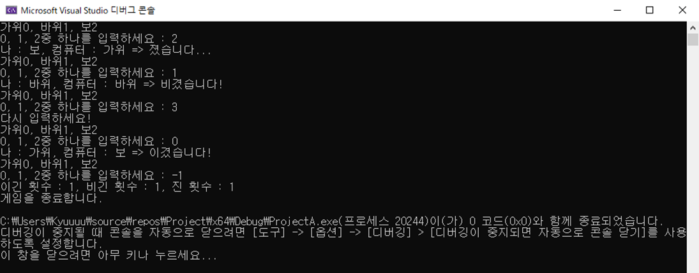
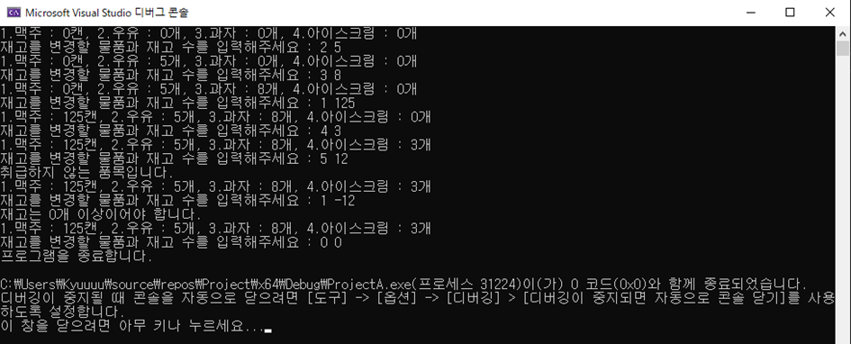

# 📝 C프로그래밍 실습 자료

## #️⃣ 13주차 [11월 18일 ~ 11월 24일]

## 📖 1번 문제
- ### 랜덤 함수를 사용하여 가위바위보 프로그램을 작성하세요. [`정답`](./practice_1.c)
> ## 조건1 : -1이 입력되기 전까지 계속 가위바위보 게임을 반복할 것
> ## 조건2 : 잘못된 값이 입력된 경우 예외처리
> ## 조건3 : 게임이 종료된 경우 이긴 횟수와 진 횟수, 비긴 횟수를 출력할 것

## 📖 2번 문제
- ### 1번 문제에서 아래 조건을 추가로 만족 시키세요. [`정답`](./practice_2.c)
> ## 조건4 = 이긴 횟수와 진 횟수, 비긴 횟수는 전역 변수로 선언할 것
> ## 조건5 = 가위바위보 결과를 처리하는 사용자 정의 함수를 만들 것 (매개변수 사용)
> ## 선택1 = 본인과 컴퓨터가 낸 수를 승부 여부를 출력하기 전에 먼저 출력하세요
>> 실행 예시 
>> 

## 📖 3번 문제
- ### main.c외에 stock.c파일을 생성하고 품목 코드와 재고를 입력 받아 편의점 재고를 관리하는 프로그램을 작성하세요
### main.c [`정답`](./main.c) stock.c[`정답`](./stock.c)
> ## 조건1 = 맥주는 1번, 우유는 2번, 과자는 3번, 아이스크림은 4번 메뉴로 지정할 것
> ## 조건2 = 조품목 코드를 입력할 때 0을 입력하면 프로그램을 종료하고 재고에 음의 값을 입력하면 예외처리를 할 것
> ## 조건3 = 입력을 받기 전에 전체 품목의 재고를 표시할 것
> ## 조건4 = 전역 변수와 외부 변수(extern)를 사용할 것
>> 실행 예시 
>> 