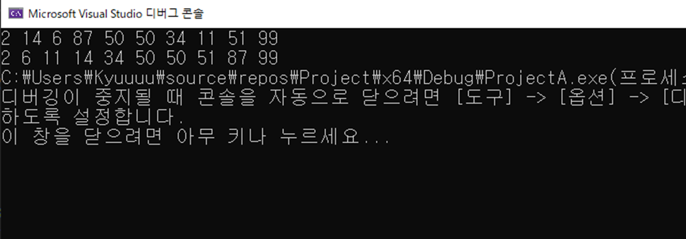
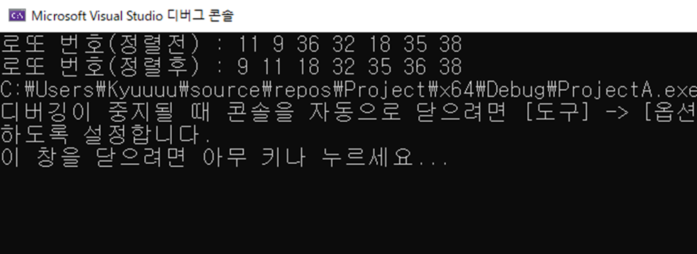
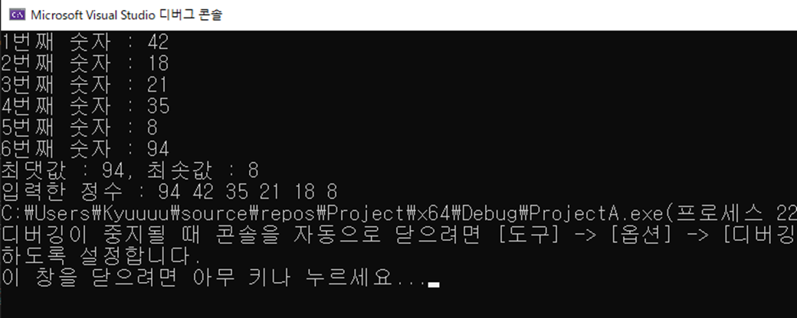

# 📝 C프로그래밍 실습 자료

## #️⃣ 13주차 [11월 25일 ~ 12월 1일]

## 📖 1번 문제
- ### 배열에 정수를 저장하고 오름차순으로 정렬하는 프로그램을 작성하세요. [`정답`](./practice_1.c)
> ## 조건1 : 버블 정렬을 참고할 것
> ## 조건2 : 정렬하기 이전의 배열과 정렬한 후의 배열을 각각 출력할 것
> ## 선택1 : 랜덤 함수를 사용하여 배열에 값을 저장하면 더 좋아요.
>> 실행 예시 
>> 

## 📖 2번 문제
- ### 랜덤 함수를 사용하여 로또 번호를 추첨하는 프로그램을 작성하세요. [`정답`](./practice_2.c)
> ## 조건1 = 로또 번호는 배열에 저장해야 하고 같은 번호가 여러 개 존재하지 않습니다.
> ## 조건2 = 번호는 1이상 45이하의 숫자를 뽑을 것
> ## 선택1 = 로또 번호를 오름차순으로 정렬하여 출력해보세요 ! (버블 정렬 사용)
>> 실행 예시 
>> 

## 📖 3번 문제
- ### 배열에 6개의 정수를 저장하고 최솟값과 최댓값을 출력하세요. [`정답`](./practice_3.c)
> ## 조건1 = 6개의 정수는 각각 다른 값을 가질 것
> ## 조건2 = 출력 결과로 배열을 내림차순으로 정렬하여 출력해보세요
>> 실행 예시 
>> 