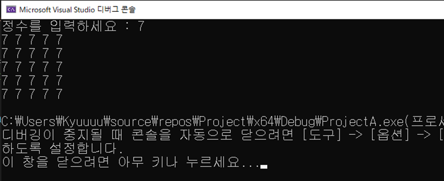
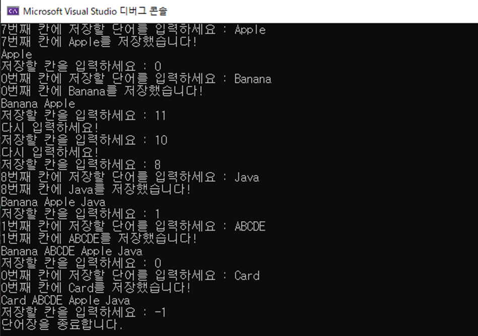
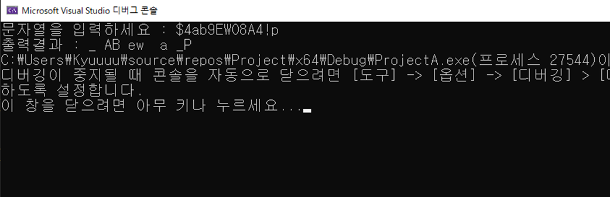
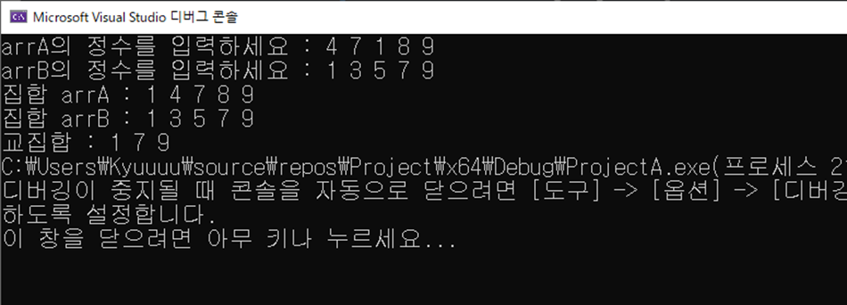

# 📝 C프로그래밍 실습 자료

## #️⃣ 14주차 [12월 2일 ~ 12월 8일]

## 📖 1번 문제
- ### 2차원 배열 arr[5][5]를 만들고 정수 num을 입력 받아 num으로 arr를 채운 후 2차원 배열을 정렬하여 출력하세요. [`정답`](./practice_1.c)
> ## 조건1 : 사용자 지정 함수를 만들어서 함수에서 배열을 출력하게 작성할 것
> ## 조건2 : 함수의 원형을 선언하고 매개변수 값으로 배열 arr을 넘길 것
>> 실행 예시 
>> 

## 📖 2번 문제
- ### 최대 10개의 단어를 원하는 칸에 저장하고 출력할 수 있는 단어장 프로그램을 작성하세요. (단 -1 입력시 종료). [`정답`](./practice_2.c)
> ## 조건1 = 하나의 단어의 크기는 최대 12글자이고 영어 단어만 저장할 것
> ## 조건2 = 단어장의 크기에 벗어나는 칸에 저장하려는 경우 예외처리를 할 것
> ## 조건3 = 저장하기 원하는 칸을 입력 받고나서 단어를 입력하게 코드를 작성할 것
>> 실행 예시 
>> 

## 📖 3번 문제
- ### 문자열을 입력 받고 대문자는 소문자로, 소문자는 대문자로, 숫자는 빈칸으로, 그 이외의 문자는 _(언더바)로 출력하세요. [`정답`](./practice_3.c)
> ## 조건1 = 문자열의 길이는 20보다 크지 않고 중간에 띄어쓰기는 없다고 가정할 것
> ## 조건2 = 아스키코드 표를 참고하여 코드를 작성할 것
>> 실행 예시 
>> 

## 📖 4번 문제
- ### 두 집합을 입력 받고 교집합을 출력하는 프로그램을 작성하세요. 단 각각 집합에는 중복되는 숫자가 없게 입력합니다. [`정답`](./practice_4.c)
> ## 조건1 = 각각 집합의 크기는 5입니다
> ## 조건2 = 집합의 원소를 출력하는 부분은 함수로 처리할 것
> ## 선택1 = 출력시에 오름차순으로 정렬하여 출력해볼 것 (함수 만들어서)
>> 실행 예시 
>> 